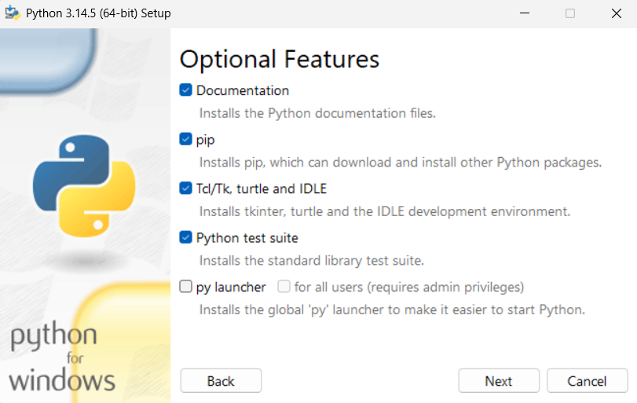
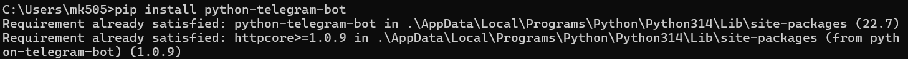
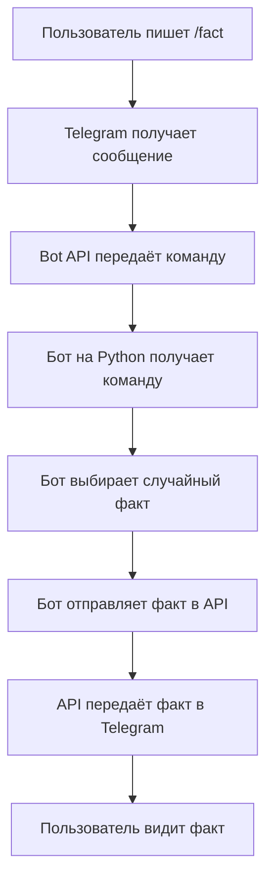
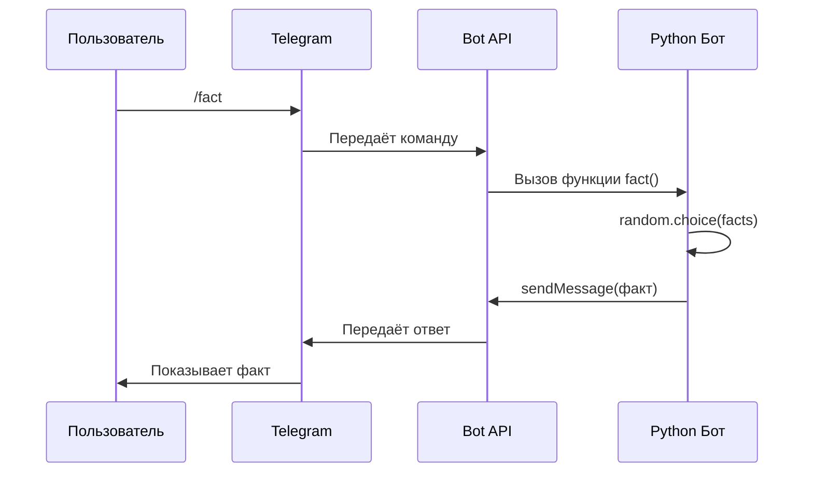
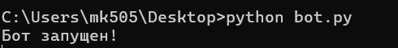

# Руководство по созданию Telegram-бота на Python

Это руководство поможет вам создать своего Telegram-бота, который отправляет случайные факты.

---

## Содержание

1. Регистрация бота
2. Установка Python
3. Установка библиотеки
4. Схема работы бота
5. Диаграмма последовательности
6. Код бота
7. Запуск бота
8. Проверка работы
9. Возможные проблемы

---

## Шаг 1. Регистрация бота

1. Откройте Telegram
2. Найдите в поиске `@BotFather`
3. Напишите команду `/newbot`
4. Придумайте имя бота
5. Придумайте username (заканчивается на `_bot`)
6. Сохраните полученный токен

**Токен выглядит так:**
```
8600213215:AADHLmxF7Ir94KrYB1ss6BAAyYnNh2_FXmM
```


---

## Шаг 2. Установка Python

1. Перейдите на [python.org](https://python.org)
2. Скачайте последнюю версию
3. Запустите установщик
4. **Обязательно** поставьте галочку `Add Python to PATH`
5. Нажмите `Install Now`



**Проверка установки:**
```bash
python --version
```

---

## Шаг 3. Установка библиотеки

Откройте командную строку и выполните:

```bash
pip install python-telegram-bot
```

Если не работает:

```bash
python -m pip install python-telegram-bot
```



---

## Шаг 4. Схема работы бота



---

## Шаг 5. Диаграмма последовательности



---

## Шаг 6. Код бота

Создайте файл `bot.py` и скопируйте код:

```python
import random
from telegram import Update
from telegram.ext import Application, CommandHandler, MessageHandler, filters

TOKEN = "ВАШ_ТОКЕН"

facts = [
    "Слоны не умеют прыгать",
    "Самая большая пицца - 1261 кв. метр",
    "Улитки спят до 3 лет",
    "Верблюды пьют 200 литров воды",
    "Дельфины дают друг другу имена",
    "Коты спят 70% жизни",
    "Банан - это ягода"
]

def start(update, context):
    update.message.reply_text("Привет! Напиши /fact")

def help_command(update, context):
    update.message.reply_text("Команды: /start, /help, /fact, /info")

def fact(update, context):
    f = random.choice(facts)
    update.message.reply_text(f)

def info(update, context):
    update.message.reply_text("Бот для проектной практики, 2026")

def echo(update, context):
    update.message.reply_text("Напиши /fact")

def main():
    print("Бот запущен")
    app = Application.builder().token(TOKEN).build()
    
    app.add_handler(CommandHandler("start", start))
    app.add_handler(CommandHandler("help", help_command))
    app.add_handler(CommandHandler("fact", fact))
    app.add_handler(CommandHandler("info", info))
    app.add_handler(MessageHandler(filters.TEXT & ~filters.COMMAND, echo))
    
    app.run_polling()

if __name__ == "__main__":
    main()
```

**Не забудьте заменить `ВАШ_ТОКЕН` на настоящий токен от BotFather.**

---

## Шаг 7. Запуск бота

В командной строке:

```bash
cd C:\Users\Ваше_Имя\Desktop\telegram_bot_project
python bot.py
```

**Успешный запуск:**
```
Бот запущен
```



> Не закрывайте окно командной строки!

---

## Шаг 8. Проверка в Telegram

Откройте Telegram и отправьте боту:

| Команда | Ответ |
|---------|-------|
| `/start` | Приветствие |
| `/help` | Список команд |
| `/fact` | Случайный факт |
| `/info` | О боте |


---

## Шаг 9. Возможные проблемы

| Проблема | Решение |
|----------|---------|
| `python не распознан` | Переустановите Python с галочкой Add to PATH |
| `No module named 'telegram'` | Выполните `pip install python-telegram-bot` |
| `Timed out` | Включите VPN |
| Бот не отвечает | Проверьте что командная строка открыта |

---

## Готово!

Вы создали Telegram-бота. Он работает и отвечает на команды.